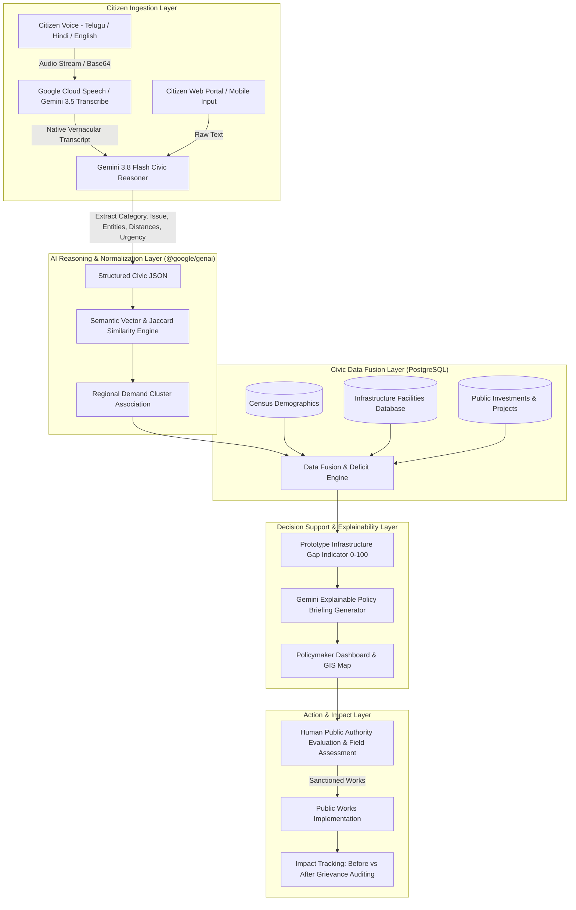

# JanSetu AI — Architecture & Technical Specifications

**Theme:** Innovation Track | Google Cloud Hackathon: *Build with AI: Code for Communities*  
**Tagline:** From Citizen Voice → Local Needs → National Priorities → Measurable Impact  

---

## 1. System Overview

**JanSetu AI** is a multilingual AI-powered civic intelligence and decision-support platform. It bridges unstructured, multilingual citizen grievances and infrastructure requests (in English, Telugu, Hindi, and regional dialects) with official demographic indices and existing public facility capacities.

### Non-Autonomous Governance Principle
JanSetu AI operates strictly as an **evidence synthesis and decision-support platform**. The AI does **NOT** autonomously allocate public funds or approve projects. It surfaces demand clusters, computes transparent infrastructure deficit indicators, and generates explainable briefings. Final administrative determinations remain exclusively with authorized human public officers.

---

## 2. End-to-End Pipeline Architecture (Mermaid)

---

## 3. Core Intelligence Layer (Gemini API Integration)

JanSetu AI utilizes the modern `@google/genai` TypeScript SDK on the server-side, initialized with the mandatory `User-Agent: 'aistudio-build'` header:

1. **Complaint Analysis (`gemini-3.8-flash`)**:
   - Converts unstructured citizen complaints into structured JSON.
   - Extracts: `language`, `category`, `issue`, `location`, `district`, `state`, `urgency`, `requested_service`, `travel_distance_km`, `summary`, and `keywords`.
2. **Semantic Similarity & Demand Clustering (`gemini-3.8-flash`)**:
   - Aggregates disparate complaints sharing underlying root causes (e.g. maternal care, flood cutoffs, fluoride water).
3. **Infrastructure Deficit Reasoning (`gemini-3.8-flash`)**:
   - Compares rural population dependencies with existing facility accessibility scores.
4. **Explainable Policy Memo Generation (`gemini-3.8-flash`)**:
   - Synthesizes objective policy briefings citing exact demand numbers, rural population percentages, and facility counts.
5. **Speech Transcription (`gemini-3.5-transcribe`)**:
   - Transcribes spoken audio files in native regional Indian languages.

---

## 4. Prototype Infrastructure Gap Indicator Formulation

The **Prototype Infrastructure Gap Indicator (0–100)** is a transparent, multi-dimensional metric calculated as:

$$\text{Gap Score} = 0.25(D) + 0.15(P) + 0.20(C) + 0.20(A) + 0.10(U) + 0.10(I)$$

Where:
- **$D$ (Citizen Demand Concentration, 25%):** Normalized logarithmic request volume in cluster.
- **$P$ (Population Affected Ratio, 15%):** Percentage of district population residing in rural habitations.
- **$C$ (Facility Coverage Deficit, 20%):** Discrepancy between actual operational facilities and national per-capita health/service standards.
- **$A$ (Transit & Accessibility Barrier, 20%):** Mean reported commute distance combined with inverse facility accessibility indices.
- **$U$ (Urgency Weighting, 10%):** High = 90, Medium = 60, Low = 35.
- **$I$ (Investment Alignment Deficit, 10%):** Evaluates whether active budget lines already address this sector.

---

## 5. Database Schema (PostgreSQL)

- `citizens`: Anonymized identity hashes, language preferences, district.
- `citizen_requests`: Full grievance history, original vernacular text, normalized text, extracted travel km, cluster foreign key.
- `request_clusters`: Spatial and sectoral aggregations, demand concentration tier, prototype gap scores.
- `demographics`: Population, rural/urban distribution, literacy rate, geographical area.
- `infrastructure`: Public health centres, hospitals, schools, capacities, geographic coordinates, accessibility indices.
- `investments`: Approved budget records, ongoing civil contracts, implementing bodies.
- `impact_metrics`: Longitudinal before vs after indicators (requests drop, travel reduction, accessibility gains).
- `ai_analysis_logs`: Auditable logs of Gemini prompts, outputs, and latency ms.

---

## 6. Google Cloud Technologies

| Technology | Implementation Scope |
| :--- | :--- |
| **Gemini API (@google/genai)** | Structured entity extraction, semantic similarity, explainable policy briefings |
| **Google Cloud Speech-to-Text / Gemini Transcribe** | Regional language voice complaint processing (Telugu, Hindi, English) |
| **Google Maps Platform** | Geocoding and spatial hotspot mapping with interactive SVG fallback |
| **Google Cloud Run** | Unified containerized full-stack deployment on port 3000 |
| **Cloud SQL / PostgreSQL** | Relational data persistence with normalized schema & migration scripts |

---

## 7. Scalability & Regional Adaptability (BRICS & Global)

The data model and prompt pipeline decouple geographic terminology from code logic:
- Configurable administrative hierarchy: `Country → State/Province → District/Municipality → Habitation/Ward`.
- Dynamic language abstraction: additional Indic or global languages can be added via the multilingual prompt template without modifying backend routing.
